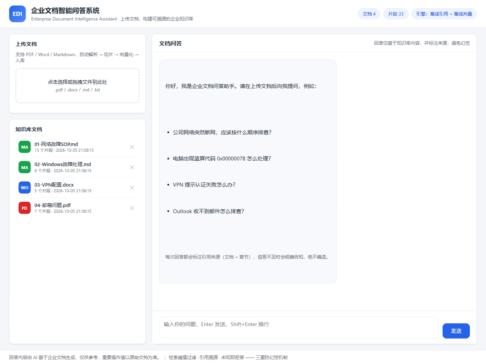
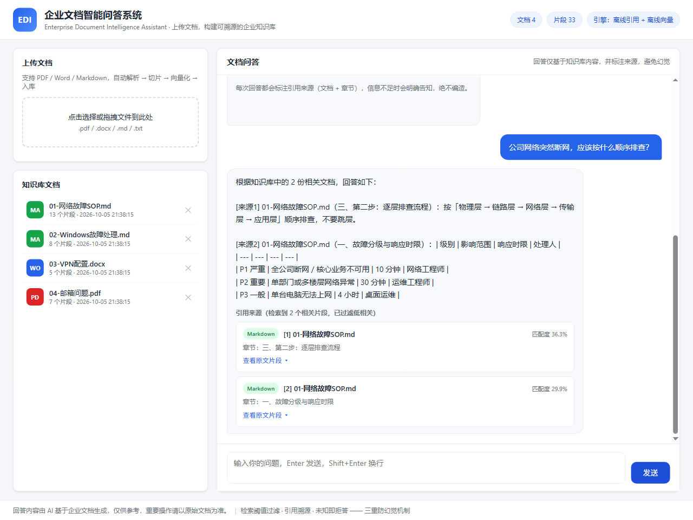
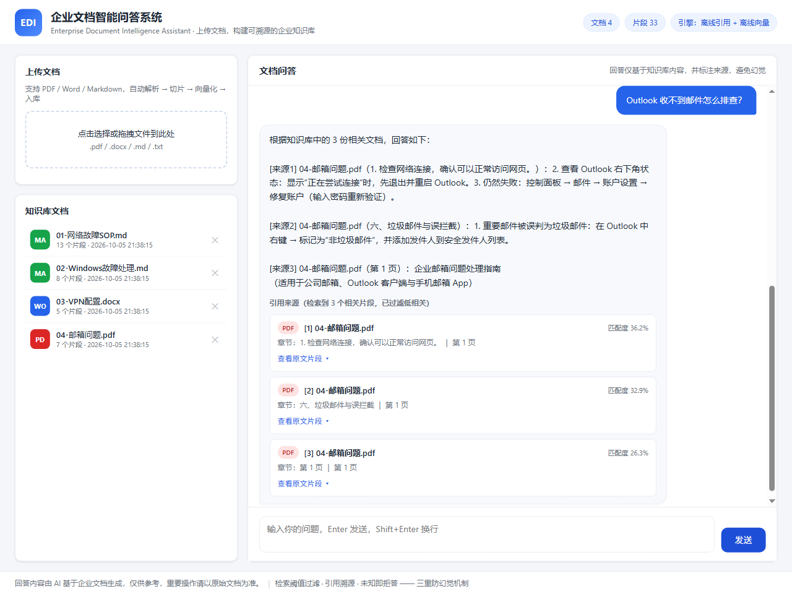
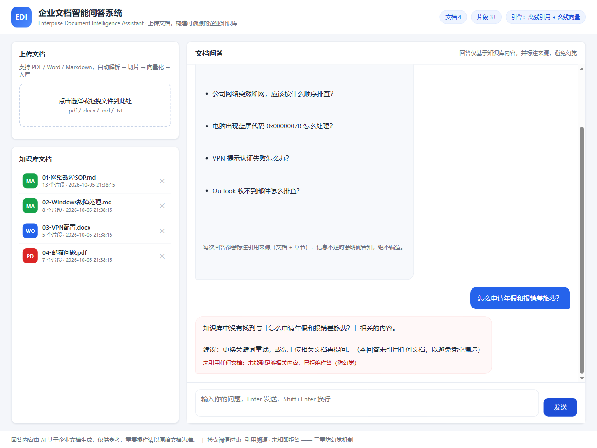
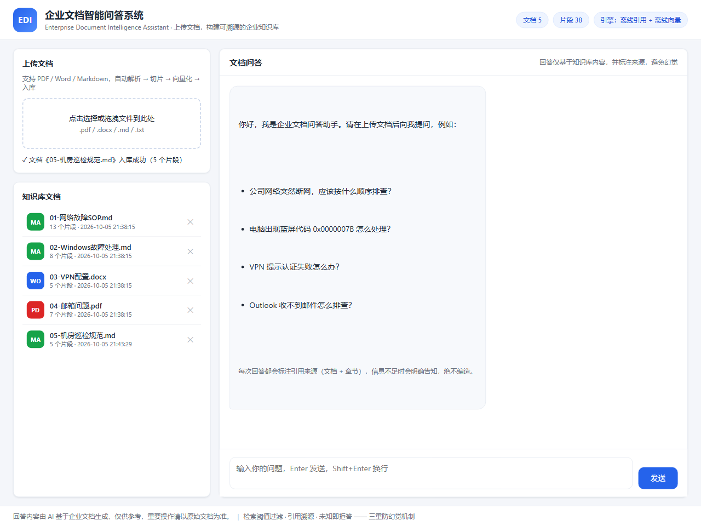
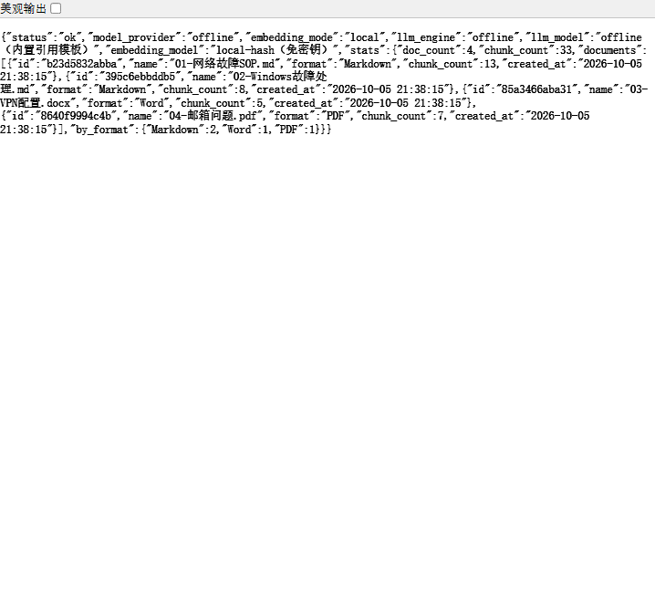

# 📚 Enterprise Document Intelligence Assistant 企业文档智能问答系统

    

## 🚀 在线体验与演示

| 页面 | 说明 | 入口 |
| --- | --- | --- |
| 🖥️ **企业 AI 案例展示页** | 作品集展示：企业案例 / RAG 管线 / 国产模型 / 国内部署 / 演示截图 | [打开展示页 showcase.html](showcase.html) |
| 🧪 **在线功能演示页** | 真实操作：上传文档、问答、引用溯源、拒答演示 | [功能演示 http://127.0.0.1:8000/demo.html](http://127.0.0.1:8000/demo.html) |

> 展示页在 GitHub 上可直接打开；功能演示页需先启动服务（`python scripts/run.py`），或直接访问源码 [`static/demo.html`](static/demo.html)。

---

> **面向企业员工的文档知识问答助手**：上传 PDF / Word / Markdown，自动完成「解析 → 切片 → 向量化 → 检索 → **重排序（Rerank）** → AI 回答 → 引用溯源」，内置三重防幻觉机制。
>
> **企业 AI 落地视角**：一套代码同时支持 **RAG 知识问答**、**检索重排序（检索→重排→生成）**、**国产大模型一键切换**（通义千问 / 智谱 / DeepSeek / 月之暗面 / 硅基流动）与 **中国大陆零外网依赖部署** —— 前端零 CDN、零 npm、离线可用、数据本地化。
>
> 本项目由开源项目 **n8n-rag-chatbot**（n8n + Qdrant + Gemini 原型）改造而来：从可视化工作流升级为**可独立部署、可离线演示、可接入任意大模型网关**的企业级 RAG 应用。
>
> 🇨🇳 中国大陆部署指南见 **[README_CN.md](README_CN.md)**。

---

## ✨ 核心能力

| 能力 | 说明 |
| --- | --- |
| 📤 多格式上传 | PDF / Word（.docx）/ Markdown（.md / .txt），拖拽或选择文件，自动入库 |
| 🔄 完整 RAG 管线 | 文档解析 → 章节感知切片 → 向量化 → 混合检索 → **重排序（Rerank）** → LLM 回答，全链路代码实现 |
| 🎯 检索重排序 | 粗排召回 → **Rerank 精排**（offline 免密钥 / llm 大模型重排）→ Top-K，紧跟主流「检索→重排→生成」架构 |
| 📏 检索可评测 | 内置评测集与脚本（`scripts/evaluate.py`）：命中率 Hit Rate + 库外拒答率一键跑分 |
| 📌 引用溯源 | 每条回答标注 **[来源编号]**，前端展示来源卡片：文档名、章节、页码、匹配度、原文片段 |
| 🛡️ 防幻觉三重机制 | ① 相似度阈值过滤低相关片段 ② 强约束提示词「仅依据文档作答，不知道就明说」③ 库外问题直接拒答并给出建议 |
| 🧠 多厂商引擎 | **国产大模型一键切换**（`MODEL_PROVIDER=qwen/zhipu/deepseek/moonshot/siliconflow`）+ 免密钥离线演示模式 |
| 🗄️ 零依赖向量库 | JSON 文件持久化 + 纯 Python 余弦相似度，无需数据库服务，单文件备份/迁移/恢复 |
| 🇨🇳 国内零外网部署 | 无 CDN / 无 npm / 无国外存储，Docker 内置国内镜像源，中国大陆直连可用 |
| 🧹 文档生命周期 | 在线查看文档列表、按文档删除并同步清理索引片段 |

## 📸 演示截图

| 首页与知识库 | 检索问答与引用 |
| --- | --- |
|  |  |

| 引用原文溯源 | 多文档回答 | 防幻觉拒答 | 文档上传入库 |
| --- | --- | --- | --- |
|  |  |  |  |

---

## 🏗️ 系统架构

```
┌─────────────────────────────────────────────────────────────────────┐
│                          Web 前端（静态单页）                         │
│        上传拖拽区 · 知识库文档管理 · 对话区 · 引用来源卡片             │
└───────────────────────────────┬─────────────────────────────────────┘
                                │ REST API
┌───────────────────────────────▼─────────────────────────────────────┐
│                     FastAPI 后端（app/）                              │
│                                                                      │
│  ┌──────────┐  ┌───────────┐  ┌────────────┐  ┌──────────────────┐  │
│  │ 解析层    │→ │  切片层    │→ │  向量化层   │→ │   向量库（JSON）  │  │
│  │ PDF/Word │  │ 章节感知   │  │ local/api  │  │ + 溯源元数据持久化│  │
│  │ Markdown │  │ +重叠窗口  │  │  Embedding │  │                  │  │
│  └──────────┘  └───────────┘  └────────────┘  └──────────────────┘  │
│                                                                      │
│  ┌─────────────────────────────────────────────────────────────┐   │
│  │  检索层：混合检索（语义余弦 60% + 词法 BM25-lite 40%）        │   │
│  │          ↓ 粗排召回 Top-C 候选（RERANK_CANDIDATES=8）          │   │
│  │  重排层：Rerank 精排（offline 词法+结构信号 / llm 大模型打分） │   │
│  │          ↓ 阈值过滤（MIN_SCORE=0.24）↓ Top-K=4                │   │
│  └─────────────────────────────────────────────────────────────┘   │
│                          ↓ 证据片段 + 溯源元数据                      │
│  ┌───────────────────────────────────────────────────────────────┐   │
│  │  LLM 层：引用约束提示词（系统级防幻觉）+ [来源编号] 一致性校验    │   │
│  │          offline 引用模板  /  api OpenAI 兼容 Chat 接口          │   │
│  └───────────────────────────────────────────────────────────────┘   │
└─────────────────────────────────────────────────────────────────────┘
```

**RAG 问答链路（一次完整请求）：**

```
员工提问
   │
   ▼
Embedding(问题) ──► 混合检索：语义余弦 + 词法分（粗排召回 Top-8）
   │                     │
   │              Rerank 精排：offline 词频/标题/位置加权，或 llm 大模型打分
   │                     │
   │              相似度 < 0.24 → 过滤（不进入回答，防止低质引用）
   │                     │
   │              保留 Top-4 证据片段（文档名/章节/页码/匹配度）
   │                     ▼
   └──► LLM 依据证据作答，强制 [来源编号] 标注
               │
               ▼
        前端渲染：回答 + 引用来源卡片 + 原文片段
```

---

## 🚀 快速开始

### 方式一：本地运行（免密钥，离线演示）

```bash
# 1. 安装依赖（Python 3.10+；国内环境可加 -i 清华源加速）
python -m venv .venv
.venv\Scripts\activate          # Windows
pip install -r requirements.txt -i https://pypi.tuna.tsinghua.edu.cn/simple

# 2. 灌入演示知识库（IT 运维：网络故障SOP / Windows故障 / VPN配置 / 邮箱问题）
python scripts/ingest.py --dir data/knowledge_base --reset

# 3. 启动服务
python scripts/run.py
# 浏览器打开 http://127.0.0.1:8000
```

> 默认 `MODEL_PROVIDER=offline`（本地向量 + 内置引用模板），**无需任何 API Key** 即可体验完整 RAG 问答与引用溯源。

### 方式二：Docker 一键部署

```bash
# 国内环境先配置 Docker 镜像加速（见 README_CN.md 2.1）
docker compose up -d --build
# 访问 http://localhost:8000
```

### 接入真实大模型（推荐企业正式使用，国产模型一键切换）

复制 `.env.example` 为 `.env`，设置 `MODEL_PROVIDER` 与密钥即可，**网关地址与模型名已内置**：

```ini
# 示例：通义千问（阿里云百炼，国内直连）
MODEL_PROVIDER=qwen
LLM_API_KEY=sk-xxx

# 示例：智谱AI GLM-4-Flash（免费额度）
# MODEL_PROVIDER=zhipu
# LLM_API_KEY=xxx.xxx

# 示例：DeepSeek / 月之暗面 Kimi / SiliconFlow（详见 README_CN.md 第四节）
```

| Provider | 厂商 | 默认模型 | 网关 |
| --- | --- | --- | --- |
| `qwen` | 通义千问 | qwen-plus | dashscope.aliyuncs.com（国内） |
| `zhipu` | 智谱AI | glm-4-flash | open.bigmodel.cn（国内） |
| `deepseek` | DeepSeek | deepseek-chat | api.deepseek.com（国内） |
| `moonshot` | 月之暗面 | moonshot-v1-8k | api.moonshot.cn（国内） |
| `siliconflow` | 硅基流动 | Qwen/Qwen2.5-7B-Instruct | api.siliconflow.cn（国内） |
| `openai` | OpenAI | gpt-4o-mini | api.openai.com（海外） |

重启后回答将由真实 LLM 生成，引用约束提示词与一致性校验自动生效。

---

## 🧪 演示知识库：IT 运维知识库

内置 4 份演示文档（覆盖三种格式），可直接用于演示与面试讲解：

| 文档 | 格式 | 内容 |
| --- | --- | --- |
| 01-网络故障SOP.md | Markdown | 故障分级、逐层排查流程（物理→链路→网络→传输→应用）、DNS/DHCP/IP 冲突速查、恢复验证清单 |
| 02-Windows故障处理.md | Markdown | 蓝屏代码速查表（0x7B/0x0A/0x1E/0xD1）、电脑变慢、无法开机、打印机、系统更新失败 |
| 03-VPN配置.docx | Word | 客户端安装、首次连接配置、常见错误处理（认证失败/无法连接/掉线）、MFA、安全规范 |
| 04-邮箱问题.pdf | PDF | Outlook 无法收发、密码锁定、发送延迟、附件限制、容量满、垃圾邮件、手机端配置 |

**可直接演示的问题：**

- 「电脑蓝屏代码 0x0000007B 怎么处理」→ 命中 Windows 手册蓝屏速查表
- 「公司网络突然断网，应该按什么顺序排查」→ 命中网络故障 SOP 逐层排查流程
- 「VPN 提示认证失败怎么办」→ 命中 VPN 配置手册
- 「Outlook 收不到邮件怎么排查」→ 命中邮箱问题 PDF
- 「怎么申请年假和报销差旅费」→ **拒答**（知识库外问题，验证防幻觉）

---

## 🏢 企业 AI 应用落地案例

> **场景**：某公司 IT 运维部门建设「运维知识助手」，让一线员工自助查询网络故障、Windows 故障、VPN 配置、邮箱问题等高频问题，减少对运维团队的人工咨询。

**业务价值**：

| 指标 | 传统模式 | 接入本系统后 |
| --- | --- | --- |
| 高频问题咨询 | 运维人工应答，重复度 > 60% | 员工自助问答，7×24 在线 |
| 知识查找 | 翻文档/问同事，单次 5~15 分钟 | 秒级检索 + 引用原文可核对 |
| 回答可信度 | 口口相传，无依据 | 每条回答带来源文档/章节/页码 |
| 错误操作风险 | 凭经验操作 | 仅依据 SOP 作答，库外问题拒答 |

**落地链路**：上传 SOP 文档（PDF/Word/Markdown）→ 自动解析入库 → 员工提问 → 混合检索 → 大模型依据文档作答 → 引用溯源核对 → 数据全部本地化、可审计。

### 部署验证截图

| 服务运行验证（健康检查） | 演示问答（引用溯源） |
| --- | --- |
|  |  |

> 部署方式：本地 Python / Docker Compose / 国内云服务器（阿里云·腾讯云）三选一，完整步骤见 **[README_CN.md](README_CN.md)**。

---

## 🇨🇳 中国大陆部署能力

| 能力 | 说明 |
| --- | --- |
| 前端零外链 | 无 CDN / npm / 第三方 JS，静态资源随服务同源托管 |
| 国产大模型直连 | qwen / zhipu / deepseek / moonshot / siliconflow 全部国内网关 |
| Docker 国内加速 | pip 内置清华源；提供镜像加速器配置与国内基础镜像备选 |
| 数据本地化 | 无国外存储，索引为本地 JSON 文件，可整体备份迁移 |
| 国内下载通道 | 支持 Gitee（码云）镜像仓库，国内克隆可达数 MB/s |
| 风险审查 | 完整清单见 [docs/CHINA_ACCESS_REVIEW.md](docs/CHINA_ACCESS_REVIEW.md) |

---

## 🏢 RAG 企业落地能力清单

本项目面向企业知识管理场景设计，重点解决 RAG 落地的三个核心问题：

### 1. 可信 —— 回答可溯源
- 每个答案片段带 `[来源编号]`，前端同步展示**来源文档、章节、页码、匹配度、原文片段**；
- 员工可一键核对「AI 说的」与「文档原话」，从机制上建立信任。

### 2. 可控 —— 降低幻觉
| 机制 | 实现 |
| --- | --- |
| 检索质量门禁 | 混合检索 + **Rerank 精排** + `MIN_SCORE` 阈值：低相关片段根本不进回答，从源头切断幻觉 |
| 强约束提示词 | 系统级 Prompt：只准用文档片段作答、不得编造、不确定必须明说（见 `app/llm.py`） |
| 引用一致性校验 | LLM 输出的 `[n]` 编号必须落在真实证据范围内，越界即拦截（API 模式） |
| 知识库外拒答 | 检索不到足够相关内容时明确告知，不生成「看似合理」的编造答案 |
| 免责声明 | 前端固定提示「回答仅供参考，重要操作以原始文档为准」 |

### 3. 可部署 —— 适配企业 IT 环境
- **零外部服务依赖**：向量库即 JSON 文件，不要求部署 Qdrant/Milvus 等数据库，单机即可跑通；
- **双模式引擎**：无外网/无密钥的内网环境用离线模式，接入网关后平滑升级语义检索；
- **格式治理**：PDF（含页内章节识别）、Word（标题样式 + 表格）、Markdown（标题层级）统一解析；
- **数据安全**：密钥仅存 `.env`（已 gitignore），支持自定义 `DATA_DIR`，索引文件可整体备份迁移。

---

## 🔌 API 一览

| 方法 | 路径 | 说明 |
| --- | --- | --- |
| POST | `/api/documents` | 上传文档（multipart，白名单校验 .pdf/.docx/.doc/.md/.markdown/.txt，限流 30MB，防路径穿越） |
| GET | `/api/documents` | 知识库文档列表（含片段数与格式统计） |
| DELETE | `/api/documents/{doc_id}` | 删除文档并同步清理索引片段 |
| POST | `/api/query` | 文档问答：`{"query": "..."}` → 回答 + 引用来源（含 Rerank 精排） |
| GET | `/api/health` | 健康检查（引擎模式 + rerank_mode + 知识库统计） |

示例：

```bash
curl -X POST http://127.0.0.1:8000/api/query \
  -H "Content-Type: application/json" \
  -d '{"query": "电脑蓝屏代码 0x0000007B 怎么处理"}'
```

---

## 📂 项目结构

```
enterprise-document-intelligence/
├── app/
│   ├── main.py               # FastAPI 入口：上传/管理/问答 API + 静态前端
│   ├── config.py             # .env 配置 + AI Provider 注册表（MODEL_PROVIDER 国产模型映射）
│   ├── parsers/              # 解析层：PDF(页内章节) / Word(标题+表格) / Markdown(标题)
│   ├── chunker.py            # 切片层：章节感知 + 固定长度 + 重叠窗口 + 溯源元数据
│   ├── embeddings.py         # 向量化层：离线哈希向量 / OpenAI 兼容 Embedding
│   ├── vector_store.py       # 向量库：JSON 持久化 + 原子写入 + 按文档删除
│   ├── retriever.py          # 检索层：混合检索（语义 60% + 词法 40%）粗排召回
│   ├── reranker.py           # 重排层：offline 词法+结构信号精排 / llm 大模型重排 / 工厂
│   ├── llm.py                # LLM 层：引用约束提示词 + 离线引用模板 + 一致性校验
│   └── pipeline.py           # 管线编排：入库与问答的统一入口（粗排→重排→Top-K）
├── static/                   # 前端（原生 HTML/CSS/JS，无框架依赖）
├── data/
│   ├── knowledge_base/       # 演示知识库（IT 运维，PDF/Word/Markdown）
│   ├── eval_questions.json   # 检索评测集（命中问题 + 库外问题）
│   └── vector_index.json     # 向量索引（入库后生成）
├── scripts/
│   ├── run.py                # 一键启动
│   ├── ingest.py             # 离线灌库 CLI（--dir / --file / --reset）
│   ├── build_demo_kb.py      # 生成演示 Word/PDF 文档
│   ├── api_smoke_test.py     # API 冒烟验证
│   └── evaluate.py           # 检索评测：Hit Rate + 库外拒答率（--rerank 模式对比）
├── tests/
│   ├── test_pipeline.py      # 管线端到端自测（33 项断言）
│   └── test_providers.py     # AI Provider 抽象层测试（50 项断言）
├── docs/screenshots/         # 演示截图
├── Dockerfile / docker-compose.yml   # 内置国内 pip 镜像源
├── .env.example              # 配置模板（含 MODEL_PROVIDER 全量说明）
└── README.md / README_CN.md / DEPLOYMENT.md
```

---

## ✅ 测试与验证

```bash
python tests/test_pipeline.py       # 管线端到端自测（33 项断言，全部通过）
python tests/test_providers.py      # AI Provider 抽象层测试（50 项断言，全部通过）
python scripts/api_smoke_test.py    # 在线 API 冒烟验证（需服务已启动）
python scripts/evaluate.py          # 检索评测：命中率 Hit Rate + 库外拒答率（12 题命中 92% / 拒答 100%）
```

覆盖范围：三种格式解析、切片与元数据、入库持久化、四类典型问题检索命中、引用编号与证据一致、**库外问题拒答（幻觉抑制）**、文档删除与索引清理、非法格式拦截，以及 **6 家模型厂商的网关/模型名解析、Embedding 能力推断、越界引用拦截、免密钥回退离线**。
完整报告见 [docs/TEST_REPORT.md](docs/TEST_REPORT.md)；检索评测报告见 [docs/EVAL_REPORT.md](docs/EVAL_REPORT.md)。

---

## 🔭 路线图

- [x] Rerank 重排序（offline 免密钥 / llm 大模型重排，`RERANK_MODE` 一键切换）
- [x] 检索评测集（Hit Rate + 库外拒答率，`scripts/evaluate.py`）
- [ ] 接入 bge-reranker 交叉编码模型（更大知识库上精度更高）
- [ ] 评测指标扩展（Recall / Precision / Faithfulness）
- [ ] 会话记忆（多轮上下文）
- [ ] 流式回答（SSE）
- [ ] 用户权限与文档级 ACL（企业多部门隔离）
- [ ] 索引增量更新与版本化

---

## 💻 技术栈

- **后端**：Python · FastAPI · Uvicorn
- **解析**：PyMuPDF（PDF）· python-docx（Word）
- **检索**：纯 Python 混合检索（语义余弦 + BM25-lite）粗排 + **Rerank 重排**（offline / llm）+ 阈值门禁
- **RAG / Agent / Workflow**：文档解析→切片→向量化→混合检索→LLM 回答→引用溯源的完整自动化工作流（`app/pipeline.py` 编排）
- **LLM / Embedding**：**AI Provider 抽象层**（`MODEL_PROVIDER` 一键切换国产模型：通义千问 / 智谱 / DeepSeek / 月之暗面 / 硅基流动 / OpenAI）+ 内置免密钥离线模式
- **前端**：原生 HTML / CSS / JavaScript（单页应用，零构建、零 CDN）
- **部署**：本地一键启动 / Docker Compose（内置国内 pip 镜像）/ 国内云服务器（阿里云·腾讯云）

## 📄 License

MIT —— 基于 [n8n-rag-chatbot](https://github.com/syedshahidashiqali/n8n-rag-chatbot)（MIT）改造，自由使用、修改、分发。
